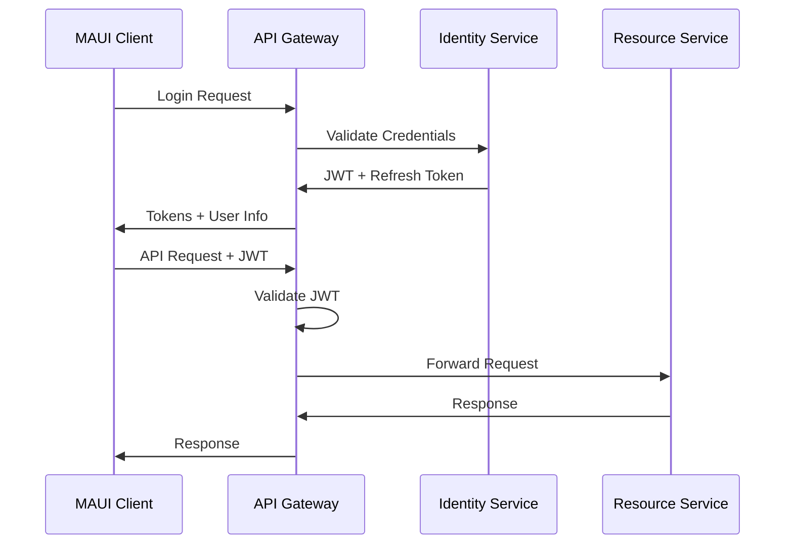
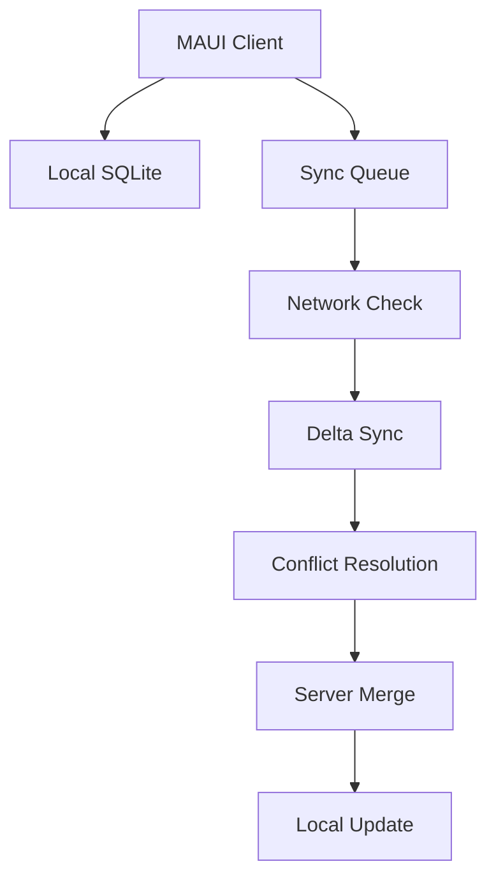

# 🚀 Comprehensive MAUI & Aspire Implementation Plan
## Enterprise Project Management & Collaboration Platform

---

## 📋 **Executive Summary**

Transform the existing MAUI/Aspire foundation into a comprehensive **Enterprise Project Management & Collaboration Platform** featuring:

- **Cross-platform native apps** (iOS, Android, Windows, macOS)
- **8 orchestrated microservices** with Aspire
- **Offline-first architecture** with real-time collaboration
- **Enterprise-grade security** and compliance
- **Comprehensive monitoring** and business intelligence

---

## 🏗️ **System Architecture Overview**

### Backend Microservices Architecture

```
┌─────────────────────────────────────────────────────────┐
│                  ASPIRE ORCHESTRATION                   │
├─────────────────────────────────────────────────────────┤
│  ┌─────────────┐  ┌─────────────┐  ┌─────────────┐     │
│  │  Identity   │  │  Projects   │  │    Tasks    │     │
│  │  Service    │  │  Service    │  │   Service   │     │
│  └─────────────┘  └─────────────┘  └─────────────┘     │
│                                                         │
│  ┌─────────────┐  ┌─────────────┐  ┌─────────────┐     │
│  │Collaboration│  │    Files    │  │ Analytics   │     │
│  │  Service    │  │  Service    │  │  Service    │     │
│  └─────────────┘  └─────────────┘  └─────────────┘     │
│                                                         │
│  ┌─────────────┐  ┌─────────────┐                      │
│  │    Sync     │  │Notification │                      │
│  │  Service    │  │  Service    │                      │
│  └─────────────┘  └─────────────┘                      │
└─────────────────────────────────────────────────────────┘
```

### Data Architecture

```
┌─────────────────┐    ┌─────────────────┐    ┌─────────────────┐
│   SQL Server    │    │  Azure Cosmos   │    │  Azure Blob     │
│   (OLTP Data)   │    │  (Real-time)    │    │  (File Storage) │
│                 │    │                 │    │                 │
│ • Projects      │    │ • Chat Messages │    │ • Documents     │
│ • Tasks         │    │ • Activity Feed │    │ • Images        │
│ • Users         │    │ • Presence      │    │ • Attachments   │
│ • Permissions   │    │ • Notifications │    │ • Versions      │
└─────────────────┘    └─────────────────┘    └─────────────────┘
```

---

## 📱 **MAUI Client - Comprehensive UI Specification**

### 🔐 **Authentication & Onboarding Flow**

#### 1. Welcome & Authentication Views
- **Welcome Screen**
  - Company logo, value proposition
  - Login/Register buttons
  - Social login options (Google, Microsoft, Apple)
  
- **Login View**
  - Email/password fields with validation
  - "Remember me" checkbox
  - Forgot password link
  - Biometric login option (Touch ID, Face ID, Windows Hello)
  
- **Registration View**
  - Multi-step wizard: Personal Info → Company Info → Preferences
  - Email verification flow
  - Terms & privacy acceptance
  
- **Onboarding Tutorial**
  - Interactive walkthrough (5 screens)
  - Feature highlights with animations
  - Skip option for experienced users

#### 2. Profile & Settings
- **Profile View**
  - Avatar upload with camera/gallery options
  - Personal information editing
  - Role and team assignments display
  
- **Settings View**
  - Account settings
  - Notification preferences (push, email, in-app)
  - Privacy controls
  - Theme selection (light/dark/auto)
  - Language preferences
  - Offline sync settings

---

### 🏠 **Main Application Shell**

#### App Shell Structure
```xaml
<Shell>
  <FlyoutHeader>
    <!-- User avatar, name, current project -->
  </FlyoutHeader>
  
  <FlyoutItem Title="Dashboard" Icon="home.png">
    <Tab Title="Overview" Icon="dashboard.png"/>
    <Tab Title="My Tasks" Icon="tasks.png"/>
    <Tab Title="Activity" Icon="activity.png"/>
  </FlyoutItem>
  
  <FlyoutItem Title="Projects" Icon="projects.png"/>
  <FlyoutItem Title="Tasks" Icon="tasks.png"/>
  <FlyoutItem Title="Collaboration" Icon="chat.png"/>
  <FlyoutItem Title="Files" Icon="files.png"/>
  <FlyoutItem Title="Reports" Icon="analytics.png"/>
  <FlyoutItem Title="Time Tracking" Icon="timer.png"/>
  
  <FlyoutFooter>
    <!-- Settings, help, logout -->
  </FlyoutFooter>
</Shell>
```

#### Navigation Bar (Bottom/Top based on platform)
- **iOS**: Bottom tab bar with 5 main sections
- **Android**: Bottom navigation with material design
- **Windows**: Top navigation with fluent design
- **macOS**: Sidebar navigation

---

### 📊 **Dashboard Views**

#### 1. Main Dashboard
- **Header Section**
  - Welcome message with user name
  - Current date/time
  - Notification bell with badge count
  - Search button
  
- **Quick Stats Cards**
  - Total active projects (with trend indicator)
  - Overdue tasks count (red highlight if > 0)
  - Completed tasks this week
  - Upcoming deadlines (next 7 days)
  
- **Recent Activity Timeline**
  - Last 10 activities with timestamps
  - User avatars for team activities
  - Expandable details
  - "View All Activity" button
  
- **Project Cards Grid**
  - Project thumbnail/icon
  - Project name and description
  - Progress bar with percentage
  - Team member avatars (max 3, +N more)
  - Last activity timestamp
  - Priority indicator (high/medium/low color coding)
  
- **Quick Actions Floating Button**
  - Create new project
  - Add task
  - Start timer
  - Send message

#### 2. My Tasks Dashboard
- **Filter Bar**
  - All/Assigned to me/Created by me
  - Priority filter (High/Medium/Low)
  - Status filter (To Do/In Progress/Review/Done)
  - Date range picker
  
- **Task List Views**
  - **List View**: Compact task items with checkbox, title, assignee, due date
  - **Card View**: Expanded cards with description preview
  - **Calendar View**: Tasks plotted on calendar grid
  
- **Task Item Components**
  - Priority indicator (colored dot/flag)
  - Task title with markdown support
  - Assignee avatar
  - Due date with overdue highlighting
  - Project badge
  - Comment count
  - Attachment count
  - Progress indicator for subtasks

#### 3. Activity Feed
- **Real-time Activity Stream**
  - User performed action on item
  - Timestamps (smart formatting: "2 minutes ago", "Yesterday")
  - Activity type icons
  - Expandable details
  - Direct action buttons (like, comment, share)
  
- **Activity Types**
  - Task created/updated/completed
  - Project milestone reached
  - File uploaded/modified
  - Comment added
  - User joined/left project
  - Time logged

---

### 📁 **Project Management Views**

#### 1. Projects List View
- **Header Controls**
  - Create project button
  - View toggle (grid/list)
  - Sort options (name, date, priority, progress)
  - Search and filter bar
  
- **Project Cards**
  - **Grid View**: 2-column grid with large project cards
  - **List View**: Compact single-column list
  
- **Project Card Components**
  - Project cover image/color theme
  - Project name and description
  - Progress ring with percentage
  - Team size indicator
  - Last activity timestamp
  - Star/favorite button
  - Context menu (edit, duplicate, archive, delete)

#### 2. Project Detail View
- **Project Header**
  - Cover image with overlay
  - Project name (editable inline)
  - Description (expandable)
  - Progress indicator
  - Project settings button
  
- **Tab Navigation**
  - Overview
  - Tasks (Kanban/List)
  - Timeline/Gantt
  - Team
  - Files
  - Activity
  
- **Overview Tab**
  - Project statistics dashboard
  - Milestone timeline
  - Recent activity
  - Team member cards
  - Quick actions

#### 3. Project Creation Wizard
- **Step 1: Basic Information**
  - Project name (required)
  - Description (rich text editor)
  - Project template selection
  - Cover image selection
  
- **Step 2: Team & Permissions**
  - Team member invitation
  - Role assignment
  - Permission levels
  - Public/private setting
  
- **Step 3: Timeline & Goals**
  - Start and end dates
  - Milestone definition
  - Success criteria
  - Budget information (optional)

---

### ✅ **Task Management Views**

#### 1. Kanban Board View
- **Board Header**
  - Board name
  - Add column button
  - View options (compact/detailed)
  - Filter and search
  
- **Column Structure**
  - Customizable columns (To Do, In Progress, Review, Done)
  - Column headers with task counts
  - Add task button in each column
  - Column settings (rename, color, limits)
  
- **Task Cards**
  - Task title
  - Priority indicator
  - Assignee avatar
  - Due date badge
  - Labels/tags
  - Comment and attachment counts
  - Checkbox for quick completion
  
- **Drag & Drop**
  - Smooth animations
  - Visual feedback during drag
  - Column highlighting on hover
  - Undo functionality

#### 2. Task Detail View
- **Task Header**
  - Task title (editable)
  - Status dropdown
  - Priority selector
  - Assignee selector
  - Due date picker
  
- **Task Content Tabs**
  - Description (rich text editor)
  - Subtasks (checklist)
  - Comments (threaded)
  - Attachments (file grid)
  - Time tracking
  - History (audit trail)
  
- **Side Panel**
  - Quick actions
  - Related tasks
  - Project context
  - Task dependencies

#### 3. Task Creation Forms
- **Quick Add**
  - Title only with smart defaults
  - Context-aware (inherits project, assignee)
  
- **Detailed Form**
  - Full task information
  - Template selection
  - Bulk creation options
  - Recurring task setup

---

### 💬 **Collaboration Views**

#### 1. Team Chat Interface
- **Chat List**
  - Direct messages
  - Project channels
  - Group conversations
  - Unread message indicators
  - Online status indicators
  
- **Chat View**
  - Message bubbles with timestamps
  - Typing indicators
  - Message reactions
  - File sharing
  - Voice messages
  - @mentions with autocomplete
  
- **Rich Message Features**
  - Markdown formatting
  - Code syntax highlighting
  - Link previews
  - Image/video previews
  - Task/project references

#### 2. Video Conferencing Integration
- **Meeting Scheduler**
  - Calendar integration
  - Participant invitation
  - Agenda setting
  - Recording options
  
- **In-Meeting Controls**
  - Mute/unmute
  - Video toggle
  - Screen sharing
  - Participant list
  - Chat sidebar

#### 3. Activity & Presence
- **Presence Indicators**
  - Online/offline status
  - "Currently working on" status
  - Custom status messages
  
- **Activity Streams**
  - Real-time project updates
  - @mention notifications
  - Smart activity grouping

---

### 📂 **File Management Views**

#### 1. File Browser
- **Navigation**
  - Breadcrumb navigation
  - Folder tree sidebar
  - Back/forward buttons
  - Search functionality
  
- **File Grid/List Views**
  - Thumbnail previews
  - File names and metadata
  - Share status indicators
  - Version indicators
  - Context menus
  
- **File Upload**
  - Drag & drop support
  - Multiple file selection
  - Progress indicators
  - Automatic organization

#### 2. File Detail & Preview
- **Preview Pane**
  - Document preview (PDF, images, videos)
  - Code syntax highlighting
  - 3D model viewers
  
- **File Information**
  - Version history
  - Sharing permissions
  - Download/export options
  - Comment threads
  
- **Collaborative Editing**
  - Real-time document editing
  - Conflict resolution
  - Change tracking

---

### ⏱️ **Time Tracking Views**

#### 1. Timer Interface
- **Active Timer Display**
  - Large time display
  - Task/project context
  - Start/stop/pause buttons
  - Quick task switcher
  
- **Timer History**
  - Daily time logs
  - Weekly summaries
  - Project breakdowns
  - Editable time entries

#### 2. Timesheet Views
- **Weekly Timesheet**
  - Grid layout with days and projects
  - Inline editing
  - Total calculations
  - Approval workflow
  
- **Monthly Overview**
  - Calendar heat map
  - Project time distribution
  - Productivity insights

---

### 📈 **Analytics & Reporting Views**

#### 1. Dashboard Analytics
- **Performance Metrics**
  - Task completion rates
  - Project velocity charts
  - Team productivity trends
  - Burndown charts
  
- **Interactive Charts**
  - Drill-down capabilities
  - Filter controls
  - Export options
  - Custom date ranges

#### 2. Custom Report Builder
- **Report Configuration**
  - Data source selection
  - Field selection
  - Grouping and sorting
  - Chart type selection
  
- **Report Sharing**
  - Email scheduling
  - PDF export
  - Dashboard embedding

---

## 🔧 **Backend Services Detailed Specification**

### 1. Identity Service
**Responsibilities:**
- User authentication and authorization
- Role-based access control (RBAC)
- JWT token management
- Social login integration
- Multi-factor authentication

**API Endpoints:**
```csharp
POST /auth/login
POST /auth/register
POST /auth/refresh
POST /auth/logout
GET  /auth/profile
PUT  /auth/profile
POST /auth/forgot-password
POST /auth/reset-password
POST /auth/mfa/setup
POST /auth/mfa/verify
```

**Technologies:**
- ASP.NET Core Identity
- Azure AD B2C
- JWT Bearer tokens
- OAuth 2.0/OpenID Connect

### 2. Projects Service
**Responsibilities:**
- Project lifecycle management
- Project templates
- Team assignment
- Permission management

**API Endpoints:**
```csharp
GET    /projects
POST   /projects
GET    /projects/{id}
PUT    /projects/{id}
DELETE /projects/{id}
POST   /projects/{id}/members
DELETE /projects/{id}/members/{userId}
GET    /projects/{id}/permissions
PUT    /projects/{id}/permissions
```

**Domain Models:**
```csharp
public class Project
{
    public Guid Id { get; set; }
    public string Name { get; set; }
    public string Description { get; set; }
    public DateTime StartDate { get; set; }
    public DateTime? EndDate { get; set; }
    public ProjectStatus Status { get; set; }
    public Guid OwnerId { get; set; }
    public List<ProjectMember> Members { get; set; }
    public List<Milestone> Milestones { get; set; }
}
```

### 3. Tasks Service
**Responsibilities:**
- Task creation and management
- Kanban board operations
- Task dependencies
- Time tracking integration

**API Endpoints:**
```csharp
GET    /tasks
POST   /tasks
GET    /tasks/{id}
PUT    /tasks/{id}
DELETE /tasks/{id}
POST   /tasks/{id}/comments
GET    /tasks/{id}/history
PUT    /tasks/{id}/status
POST   /tasks/{id}/attachments
```

### 4. Collaboration Service
**Responsibilities:**
- Real-time messaging (SignalR)
- Presence tracking
- Activity feeds
- Notification routing

**SignalR Hubs:**
```csharp
public class CollaborationHub : Hub
{
    public async Task JoinProject(string projectId)
    public async Task SendMessage(string projectId, string message)
    public async Task UpdatePresence(string status)
    public async Task TaskUpdated(string taskId, object update)
}
```

### 5. Files Service
**Responsibilities:**
- File upload/download
- Version control
- Sharing permissions
- Thumbnail generation

**API Endpoints:**
```csharp
POST   /files/upload
GET    /files/{id}
DELETE /files/{id}
GET    /files/{id}/versions
POST   /files/{id}/share
GET    /files/{id}/thumbnail
```

### 6. Analytics Service
**Responsibilities:**
- Data aggregation
- Report generation
- Business intelligence
- Performance metrics

### 7. Sync Service
**Responsibilities:**
- Offline synchronization
- Conflict resolution
- Delta updates
- Sync status tracking

### 8. Notification Service
**Responsibilities:**
- Push notifications
- Email notifications
- In-app notifications
- Notification preferences

---

## 🗄️ **Data Models & Schema**

### Core Entities

```csharp
// Users and Identity
public class User
{
    public Guid Id { get; set; }
    public string Email { get; set; }
    public string FirstName { get; set; }
    public string LastName { get; set; }
    public string AvatarUrl { get; set; }
    public UserStatus Status { get; set; }
    public DateTime LastLoginAt { get; set; }
    public List<ProjectMember> ProjectMemberships { get; set; }
}

// Projects
public class Project
{
    public Guid Id { get; set; }
    public string Name { get; set; }
    public string Description { get; set; }
    public string CoverImageUrl { get; set; }
    public DateTime StartDate { get; set; }
    public DateTime? EndDate { get; set; }
    public ProjectStatus Status { get; set; }
    public Guid OwnerId { get; set; }
    public User Owner { get; set; }
    public List<ProjectMember> Members { get; set; }
    public List<Task> Tasks { get; set; }
    public List<Milestone> Milestones { get; set; }
    public DateTime CreatedAt { get; set; }
    public DateTime UpdatedAt { get; set; }
}

// Tasks
public class Task
{
    public Guid Id { get; set; }
    public string Title { get; set; }
    public string Description { get; set; }
    public TaskStatus Status { get; set; }
    public TaskPriority Priority { get; set; }
    public DateTime? DueDate { get; set; }
    public Guid ProjectId { get; set; }
    public Project Project { get; set; }
    public Guid? AssigneeId { get; set; }
    public User Assignee { get; set; }
    public Guid CreatedById { get; set; }
    public User CreatedBy { get; set; }
    public List<TaskComment> Comments { get; set; }
    public List<TaskAttachment> Attachments { get; set; }
    public List<TimeEntry> TimeEntries { get; set; }
    public DateTime CreatedAt { get; set; }
    public DateTime UpdatedAt { get; set; }
}

// Collaboration
public class Message
{
    public Guid Id { get; set; }
    public string Content { get; set; }
    public MessageType Type { get; set; }
    public Guid SenderId { get; set; }
    public User Sender { get; set; }
    public Guid? ProjectId { get; set; }
    public Project Project { get; set; }
    public Guid? ParentMessageId { get; set; }
    public Message ParentMessage { get; set; }
    public List<MessageReaction> Reactions { get; set; }
    public DateTime CreatedAt { get; set; }
    public bool IsEdited { get; set; }
    public DateTime? EditedAt { get; set; }
}

// Files
public class ProjectFile
{
    public Guid Id { get; set; }
    public string FileName { get; set; }
    public string OriginalFileName { get; set; }
    public string ContentType { get; set; }
    public long FileSize { get; set; }
    public string BlobUrl { get; set; }
    public string ThumbnailUrl { get; set; }
    public Guid ProjectId { get; set; }
    public Project Project { get; set; }
    public Guid UploadedById { get; set; }
    public User UploadedBy { get; set; }
    public List<FileVersion> Versions { get; set; }
    public DateTime CreatedAt { get; set; }
}
```

### Enumerations

```csharp
public enum TaskStatus
{
    ToDo = 1,
    InProgress = 2,
    Review = 3,
    Done = 4,
    Cancelled = 5
}

public enum TaskPriority
{
    Low = 1,
    Medium = 2,
    High = 3,
    Critical = 4
}

public enum ProjectStatus
{
    Planning = 1,
    Active = 2,
    OnHold = 3,
    Completed = 4,
    Cancelled = 5
}

public enum UserRole
{
    Admin = 1,
    ProjectManager = 2,
    TeamLead = 3,
    Developer = 4,
    Viewer = 5
}
```

---

## 🔒 **Security Implementation**

### Authentication Flow


### Authorization Policies
```csharp
// Role-based policies
services.AddAuthorization(options =>
{
    options.AddPolicy("AdminOnly", policy => 
        policy.RequireRole("Admin"));
    
    options.AddPolicy("ProjectManager", policy => 
        policy.RequireRole("Admin", "ProjectManager"));
    
    options.AddPolicy("ProjectMember", policy =>
        policy.RequireAssertion(context =>
            context.User.HasClaim("project-member", 
                context.Resource.ToString())));
});
```

---

## 📊 **Offline Synchronization Strategy**

### Sync Architecture


### Conflict Resolution Rules
1. **Last Writer Wins** - Default for simple field updates
2. **Manual Resolution** - For critical data conflicts
3. **Merge Strategy** - For collaborative content (comments, descriptions)
4. **Version Vectors** - For complex dependency tracking

### Sync Data Models
```csharp
public class SyncItem
{
    public Guid Id { get; set; }
    public string EntityType { get; set; }
    public Guid EntityId { get; set; }
    public string Operation { get; set; } // Create, Update, Delete
    public string Data { get; set; } // JSON payload
    public DateTime Timestamp { get; set; }
    public SyncStatus Status { get; set; }
    public int RetryCount { get; set; }
}
```

---

## 🚀 **Implementation Roadmap**

### Phase 1: Foundation (Weeks 1-4)
**Backend Tasks:**
- [ ] Enhance Aspire orchestration with Redis and Service Bus
- [ ] Implement Identity Service with Azure AD B2C
- [ ] Create Projects Service with CRUD operations
- [ ] Setup comprehensive logging and monitoring
- [ ] Database schema design and migration scripts

**MAUI Tasks:**
- [ ] Implement OAuth2 authentication flow
- [ ] Create application shell and navigation
- [ ] Setup SQLite database with Entity Framework
- [ ] Basic project listing and creation UI
- [ ] Offline storage foundation

**Infrastructure:**
- [ ] CI/CD pipeline setup
- [ ] Development environment configuration
- [ ] Security scanning integration
- [ ] Automated testing framework

### Phase 2: Core Features (Weeks 5-10)
**Backend Tasks:**
- [ ] Tasks Service with full CRUD operations
- [ ] Collaboration Service with SignalR hubs
- [ ] Files Service with Azure Blob integration
- [ ] Basic sync engine implementation
- [ ] API Gateway configuration

**MAUI Tasks:**
- [ ] Project dashboard with statistics
- [ ] Kanban board implementation
- [ ] Real-time collaboration features
- [ ] File management interface
- [ ] Push notification handling

**Quality Assurance:**
- [ ] Unit test coverage (90%+ target)
- [ ] Integration testing suite
- [ ] Performance optimization
- [ ] Security vulnerability assessment

### Phase 3: Advanced Features (Weeks 11-16)
**Backend Tasks:**
- [ ] Analytics Service with reporting
- [ ] Notification Service implementation
- [ ] Advanced sync with conflict resolution
- [ ] Performance optimization
- [ ] Security hardening

**MAUI Tasks:**
- [ ] Time tracking functionality
- [ ] Advanced reporting interface
- [ ] Rich text editing capabilities
- [ ] Platform-specific optimizations
- [ ] Accessibility compliance

**Polish & Testing:**
- [ ] UI/UX refinements
- [ ] Cross-platform testing
- [ ] Performance profiling
- [ ] Beta user feedback integration

### Phase 4: Production Ready (Weeks 17-20)
**Testing & Validation:**
- [ ] Load testing and performance validation
- [ ] Security audit and penetration testing
- [ ] Cross-platform compatibility testing
- [ ] User acceptance testing (UAT)
- [ ] Accessibility compliance verification

**Deployment Preparation:**
- [ ] Production infrastructure setup
- [ ] App store submission preparation
- [ ] Monitoring dashboard configuration
- [ ] Documentation completion
- [ ] Support process establishment

### Phase 5: Launch & Scale (Week 21+)
**Beta Launch:**
- [ ] Limited beta user group (50-100 users)
- [ ] Feedback collection and analysis
- [ ] Performance monitoring and optimization
- [ ] Bug fixes and stability improvements

**Production Launch:**
- [ ] Full production deployment
- [ ] Marketing and user acquisition
- [ ] Continuous monitoring and improvement
- [ ] Feature expansion based on user feedback

---

## 🛠️ **Technology Stack Deep Dive**

### Backend Technologies
- **.NET 8** - Latest LTS version with performance improvements
- **ASP.NET Core** - High-performance web framework
- **Entity Framework Core** - Object-relational mapping
- **SignalR** - Real-time web functionality
- **Aspire** - Cloud-native application orchestration
- **Azure Services** - Comprehensive cloud platform
- **Docker** - Containerization for consistent deployments

### MAUI Technologies
- **.NET MAUI** - Cross-platform native application framework
- **CommunityToolkit.Mvvm** - MVVM helpers and source generators
- **SQLite** - Local database for offline scenarios
- **Syncfusion Controls** - Rich UI components library
- **SkiaSharp** - Cross-platform 2D graphics
- **Microsoft.Extensions.Logging** - Structured logging

### Development Tools
- **Visual Studio 2022** - Primary IDE
- **Azure DevOps** - CI/CD and project management
- **SonarQube** - Code quality analysis
- **Postman** - API testing and documentation
- **Figma** - UI/UX design and prototyping

---

## 📏 **Quality Metrics & KPIs**

### Technical Metrics
- **Code Coverage**: Minimum 90% for business logic
- **Performance**: API response time < 200ms (95th percentile)
- **Availability**: 99.9% uptime SLA
- **Security**: Zero critical vulnerabilities
- **Bug Density**: < 1 bug per 1000 lines of code

### User Experience Metrics
- **App Store Rating**: Target 4.5+ stars
- **Crash Rate**: < 0.1% sessions
- **Load Time**: App launch < 3 seconds
- **Offline Capability**: 100% core features available offline
- **Cross-platform Consistency**: UI/UX parity across platforms

### Business Metrics
- **User Adoption**: Monthly active users growth
- **Feature Usage**: Core feature adoption rates
- **Performance**: Task completion time improvements
- **Satisfaction**: Net Promoter Score (NPS) tracking

---

## 🔮 **Future Enhancements**

### Phase 6+: Advanced Features
- **AI-Powered Insights**: Machine learning for project predictions
- **Advanced Integrations**: Third-party tool connections (Slack, Jira, GitHub)
- **Workflow Automation**: Custom workflow builders
- **Advanced Analytics**: Predictive analytics and business intelligence
- **Voice Commands**: Voice-to-text and voice controls
- **AR/VR Support**: Immersive collaboration experiences

### Scalability Considerations
- **Microservices Expansion**: Additional specialized services
- **Global Distribution**: Multi-region deployment
- **Edge Computing**: Edge caching for improved performance
- **AI Services**: Integration with Azure Cognitive Services
- **IoT Integration**: Smart device connectivity

---

## 📞 **Support & Maintenance**

### Monitoring Strategy
- **Application Performance Monitoring** with Azure Application Insights
- **Real User Monitoring** for client-side performance
- **Infrastructure Monitoring** with Azure Monitor
- **Business Intelligence** dashboards for stakeholder reporting

### Support Levels
- **Level 1**: User support and basic troubleshooting
- **Level 2**: Technical support and bug investigation
- **Level 3**: Advanced technical support and escalation
- **Emergency**: Critical issue response (24/7)

### Maintenance Schedule
- **Daily**: Automated monitoring and health checks
- **Weekly**: Performance review and optimization
- **Monthly**: Security updates and patch management
- **Quarterly**: Feature updates and major improvements
- **Annually**: Platform upgrades and technology refresh

---

*This comprehensive plan provides the foundation for building a world-class enterprise project management platform using MAUI and Aspire technologies. The detailed specifications ensure all stakeholders have a clear understanding of the technical requirements, implementation timeline, and expected outcomes.*